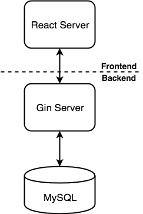
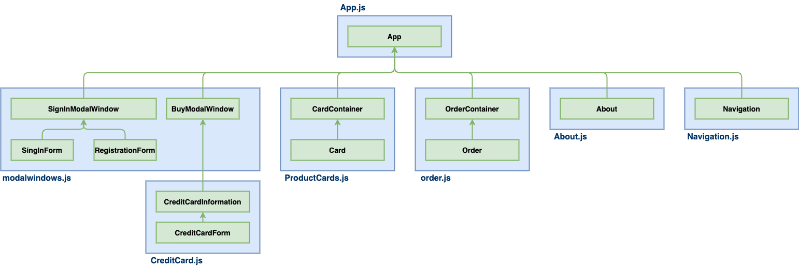
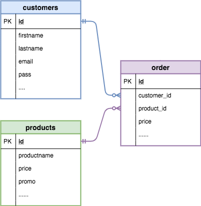

## Overview 
- [**System Archtecture**](#system-archtecture)
- [**Frontend**](#frontend)
   - [Web Modules](#web-modules)
   - [React Components And Relationship](#react-components-and-relationship)
- [**Backend**](#backend)
   - [Database Tables](#database-tables)
   - [APIs](#apis)
- [**Source Code Structure**](#source-code-structure)

## System Archtecture

## Frontend
#### Web Modules
- **Pages**
   - Products Page
   - Promotions Page
   - About Page
   - Order Page
- **Modal Windows**
   - Buy Modal Windows
   - Sign In Modal Windows
      - Sign In Form
      - Registration Form

#### React Components And Relationship

## Backend
#### Database Tables

##### customers
| Column | Type | Primary Key | Default Value | Allow Null |
|----|----|----|----|----|
| id | int(11) | Yes |  | No |
| firstname | varchar(50) |  | '0' | No |
| lastname | varchar(50) |  | '0' | No |
| email | varchar(100) |  | '0' | No |
| pass | varchar(100) |  | '0' | No |
| cc_customerid | varchar(50) |  | '0' | No |
| loggedin | tinyint(1) |  | '0' | No |
| created_at | timestamp |  | CURRENT_TIMESTAMP | Yes |
| updated_at | timestamp |  | CURRENT_TIMESTAMP | Yes |
| deleted_at | timestamp |  | NULL | Yes |

##### orders
| Column | Type | Primary Key | Default Value | Allow Null |
|----|----|----|----|----|
| id | int(11) | Yes |  | No |
| customer_id | int(11) |  |  | No |
| product_id | int(11) |  |  | No |
| price | int(11) |  |  | No |
| purchase_date | timestamp |  | CURRENT_TIMESTAMP | No |
| created_at | timestamp |  | CURRENT_TIMESTAMP | Yes |
| updated_at | timestamp |  | CURRENT_TIMESTAMP | Yes |
| deleted_at | timestamp |  | NULL | Yes |

##### products
| Column | Type | Primary Key | Default Value | Allow Null |
|----|----|----|----|----|
| id | int(11) | Yes |  | No |
| image | varchar(100) |  | NULL |  |
| smallimg | varchar(100) |  | NULL |  |
| imgalt | varchar(50) |  | NULL |  |
| description | text |  |  |  |
| productname | varchar(50) |  | NULL |  |
| price | float |  | NULL |  |
| promotion | float |  | NULL |  |
| created_at | timestamp |  | CURRENT_TIMESTAMP | Yes |
| updated_at | timestamp |  | CURRENT_TIMESTAMP | Yes |
| deleted_at | timestamp |  | NULL | Yes |

#### APIs

## Source Code Structure
- [react-app](../react-app)
   - [public](../react-app/public)
   - [src](../react-app/src)
      - [index.js](../react-app/src/index.js): This is the javascript file corresponding to index.html.
      - [Navigations.js](../react-app/src/Navigations.js): The navigational menu component.
      - [ProductCards.js](../react-app/src/ProductCards.js): The Home and Promotions page component.
      - [About.js](../react-app/src/About.js): The About page component.
      - [modalwindows.js](../react-app/src/modalwindows.js): The modal windows (credit card info, sign in, register) component.
      - [CreditCards.js](../react-app/src/CreditCards.js): The online payment component.
      - [order.js](../react-app/src/order.js): The order page component.
- [gin-app]()
   - [cmd]()
      - [main.go](../gin-app/cmd/main.go): The main function of this Gin app.
   - [db]()
      - [dblayer.go](../gin-app/db/dblayer.go): Define the database interfaces.
      - [orm.go](../gin-app/db/orm.go.go): The implementation of the database interfaces by GORM.
   - [models]()
      - [models.go](../gin-app/models/models.go): Define data models.
   - [rest]()
      - [handler.go](../gin-app/rest/handler.go): RESTful API handlers.
      - [mockHandler.go](../gin-app/rest/mockHandler.go): The mock up RESTful API handlers for testing.
      - [rest.go](../gin-app/rest/rest.go): The initializer of RESTful API.
